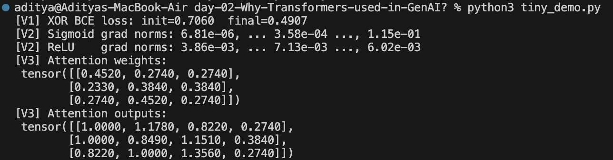

# Day 02 — Why Transformers for GenAI (NN types + backprop recap)

> Folder: `days/day-02-why-transformers-used-in-genai/`

## What I set out to do
- Recap how neural networks learn via backprop and why activations/architectures matter.
- Survey major neural network types and their strengths/limits.
- Explain why attention/Transformers are a good fit for modern GenAI workloads.

---


## WHAT I verified today (tiny proofs)

**V1 — Backprop lowers loss in a tiny MLP**
- Train a 2-layer MLP on XOR; one or more steps of SGD/Adam **reduce BCE loss**.

**V2 — Vanishing vs stable gradients (sigmoid vs ReLU)**
- Measure per-layer gradient norms in deep stacks:
  - Sigmoid stacks shrink gradients more (vanishing).
  - ReLU stacks keep healthier gradient magnitudes.

**V3 — Toy attention**
- Compute scaled dot-product attention on 3 tokens; see weights concentrate on relevant keys.

**Final Code Output:**

---

## How to run
```bash
cd days/day-02-why-transformers-used-in-genai
python tiny_demo_day2_min.py

